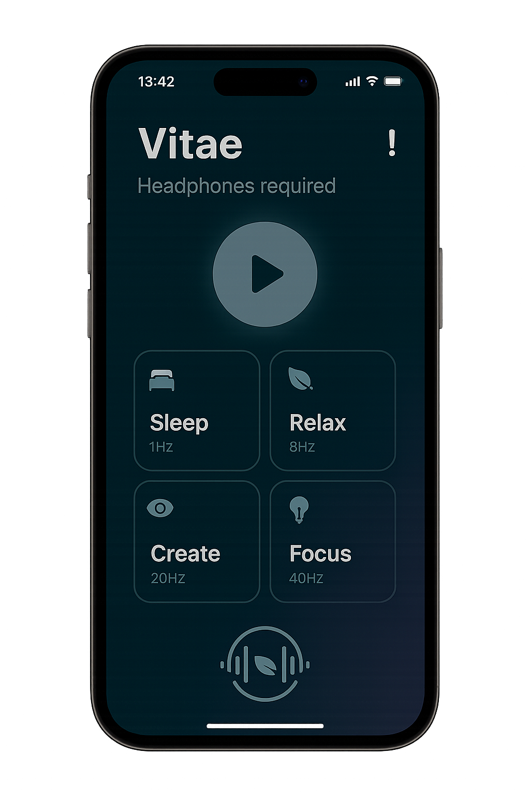

# Vitae – Minimalist Binaural Beats App 🎧✨  

> **Dors mieux. Concentre-toi plus. Relax. Crée.**  
> Vitae est l’application minimaliste qui utilise les **ondes binaurales** pour transformer ton quotidien.  

---

## 🌙 Pourquoi Vitae ?  

Dans un monde saturé d’écrans, de notifications et de stress, trouver le calme devient un luxe.  
Avec Vitae, tu peux :  

- 💤 **Trouver le sommeil plus facilement** grâce à des fréquences apaisantes  
- 🧘 **Réduire ton stress** en quelques minutes  
- 🎯 **Améliorer ta concentration** pour travailler efficacement  
- 🎨 **Stimuler ta créativité** avec des sessions sonores dédiées  

---

## 🎵 Fonctionnalités clés  

✅ **Sessions guidées** : sommeil, relaxation, concentration, créativité  
✅ **Interface minimaliste** : aucun bruit visuel, juste toi et le son  
✅ **Lecture en arrière-plan** : continue même écran éteint  
✅ **Mode clair/sombre** automatique selon ton appareil  
✅ **Qualité audio optimisée** pour casques et écouteurs  

---

## 📲 Comment ça marche ?  

1. **Choisis un mode** (Relax, Sleep, Focus, Create)  
2. **Appuie sur Play**  
3. **Laisse les fréquences binaurales agir** ✨  

---

## 🛠️ Conçu pour toi  

- Disponible sur **iOS** et **Android**  
- Léger et rapide (moins de 20 Mo)  
- Pas de comptes compliqués : **ouvre, choisis, écoute**  

---

## 🚀 Bientôt dans Vitae  

- ⏱️ Minuteur de session  
- 🎚️ Personnalisation des fréquences  
- 🌍 Communauté et partages de presets  
- 🌟 Version premium **sans pubs**  

---

## 👤 À propos  

Vitae est un projet indépendant développé avec ❤️ par **Anton Gobelait**.  
Chaque ligne de code a été pensée pour une expérience **simple, élégante et utile**.  

---

📥 **Télécharge Vitae dès maintenant** et commence ton voyage vers plus de calme, de focus et de créativité.  
